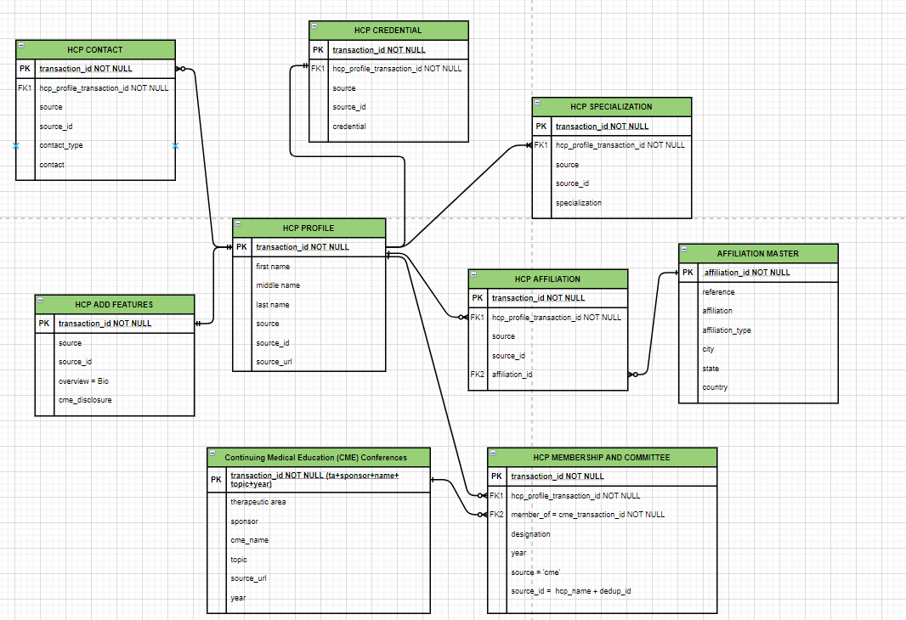

# Objective
- CME(Continuing Medical Education) Data Ingestion in different Postgres Tables using ETL Pipeline.

## Data Source
- Google Drive Link -> https://docs.google.com/spreadsheets/d/1u2edS8IYKwfBWjQQgXPhFJujtfVaWrLN-38YwZ7ExQA/edit?usp=sharing

## About Data
- The data contains following fields: 'HCP Full Name', 'HCP Dedup', 'Credential', 'Specialty', 'Institution', 'City', 'State', 'Country', 'Role', 'Topic', 'CME name', 'Year', 'Sponsor', 'Disclosures', 'Source Link', 'email', 'Notes', 'Prof or Assoc Prof etc', 'Bio', 'Source for HCP affliation or bio', 'NPI'

## Postgres Tables
- Above data will be ingested in following PA_universe tables: continuing_medical_education, hcp_profile, hcp_membership_and_committee, affiliation_master, hcp_affiliation, hcp_specialization, hcp_contact, hcp_credential, hcp_add_features

## ER Diagram
- 